# 测试
CUDA_VISIBLE_DEVICES=3 python train_parse.py 
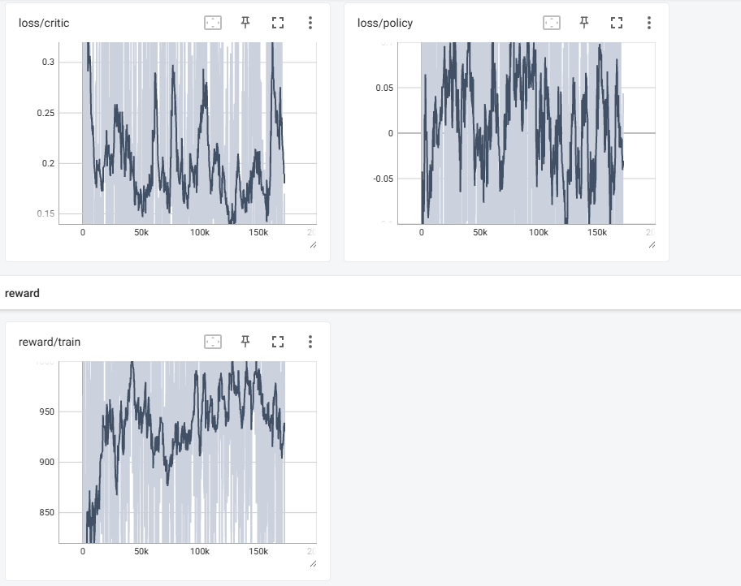
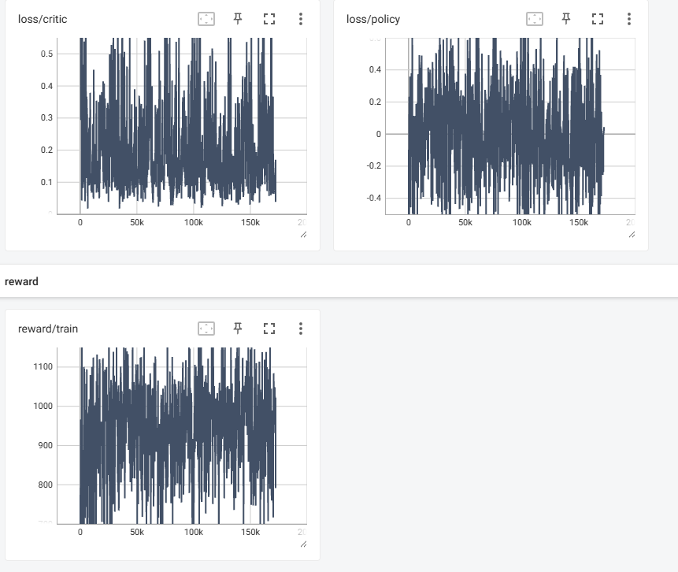

# 新的 不做reward normal
CUDA_VISIBLE_DEVICES=3 python train_parse.py --eps_clip 0.2 --gamma 0.97 --lr_actor 0.0003 --lr_critic 0.001 --pre_reward_ratio 4 --reward_scale_size 10000
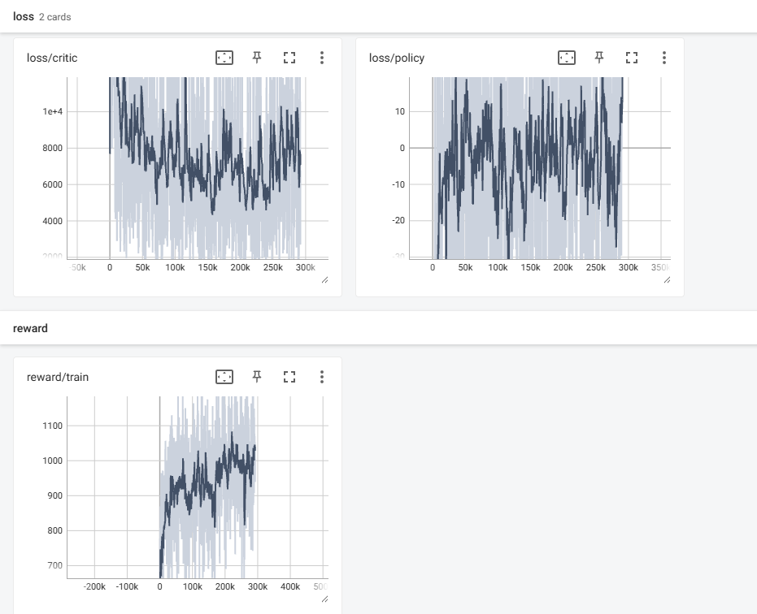

# 增大reward_scale_size
CUDA_VISIBLE_DEVICES=3 python train_parse.py --eps_clip 0.1 --gamma 0.97 --lr_actor 0.0003 --lr_critic 0.001 --pre_reward_ratio 5 --reward_scale_size 10000 --entropy_ratio 0.05

CUDA_VISIBLE_DEVICES=3 python train_parse.py --eps_clip 0.08 --gamma 0.97 --lr_actor 0.0003 --lr_critic 0.001 --pre_reward_ratio 5 --reward_scale_size 10000 --entropy_ratio 0.002 --K_epochs 4
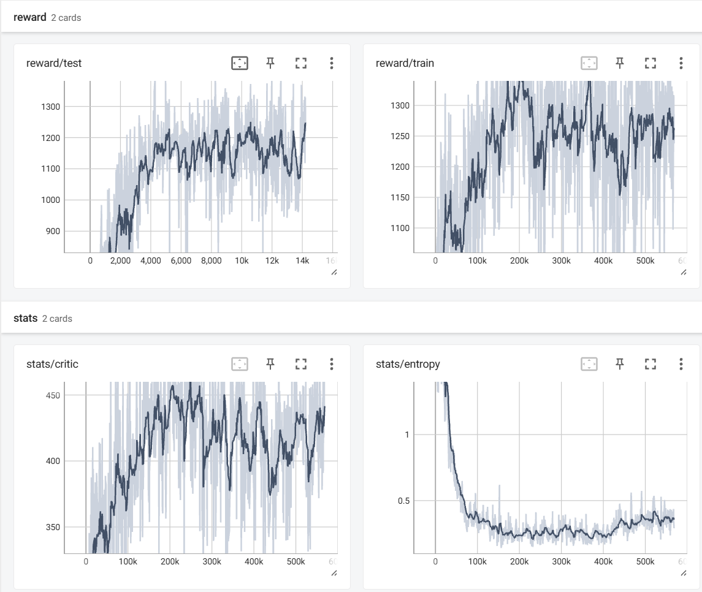

# 减小pre_reward_ratio
CUDA_VISIBLE_DEVICES=3 python train_parse.py --eps_clip 0.08 --gamma 0.97 --lr_actor 0.0003 --lr_critic 0.001 --pre_reward_ratio 3 --reward_scale_size 10000 --entropy_ratio 0.002 --K_epochs 4
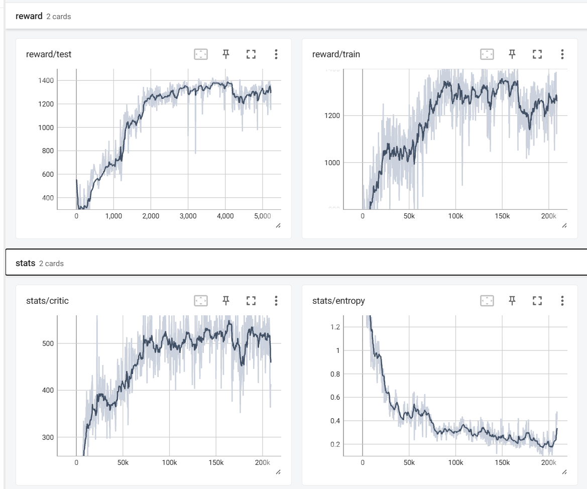

# ReLU
CUDA_VISIBLE_DEVICES=3 python train_parse.py --eps_clip 0.2 --gamma 0.97 --lr_actor 0.001 --lr_critic 0.001 --pre_reward_ratio 3 --reward_scale_size 10000 --entropy_ratio 0.002 --K_epochs 4 --buffer_punishment

# 尝试gae
CUDA_VISIBLE_DEVICES=3 python train_parse.py --eps_clip 0.1 --gamma 0.97 --lr_actor 0.0003 --lr_critic 0.001 --pre_reward_ratio 4 --reward_scale_size 10000 --entropy_ratio 0.002 --K_epochs 4 --gae_flag

# 新的state
CUDA_VISIBLE_DEVICES=3 python train_parse.py --eps_clip 0.1 --gamma 0.97 --lr_actor 0.0003 --lr_critic 0.001 --pre_reward_ratio 4 --reward_scale_size 10000 --entropy_ratio 0.002 --K_epochs 4 --gae_flag

# 增加了每收集5个就必须回一次基站的要求
CUDA_VISIBLE_DEVICES=3 python train_parse.py --eps_clip 0.1  --gamma 0.97 --lr_actor 0.0001 --lr_critic 0.0003 --pre_reward_ratio 4 --reward_scale_size 50000 --entropy_ratio 0.25  --K_epochs 1 --gae_flag --M 1
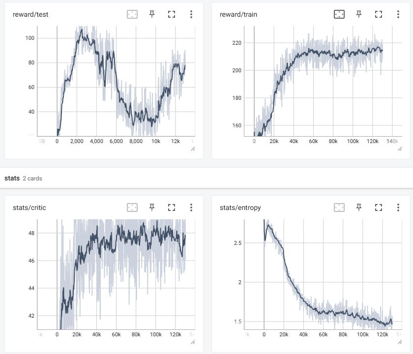

# 使用ReLU，大lr 大clip 大K_epochs
CUDA_VISIBLE_DEVICES=3 python train_parse.py --eps_clip 0.2  --gamma 0.97 --lr_actor 0.0005 --lr_critic 0.0008 --pre_reward_ratio 4 --reward_scale_size 50000 --entropy_ratio 0.25  --K_epochs 3 --gae_flag --M 1
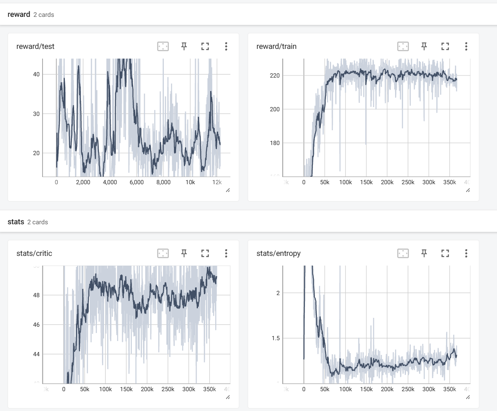

# 在上一个的基础上使用A3C
CUDA_VISIBLE_DEVICES=3 python train_parse.py --eps_clip 0.2  --gamma 0.97 --lr_actor 0.0005 --lr_critic 0.0008 --pre_reward_ratio 4 --reward_scale_size 50000 --entropy_ratio 0.25  --K_epochs 5 --gae_flag --M 1
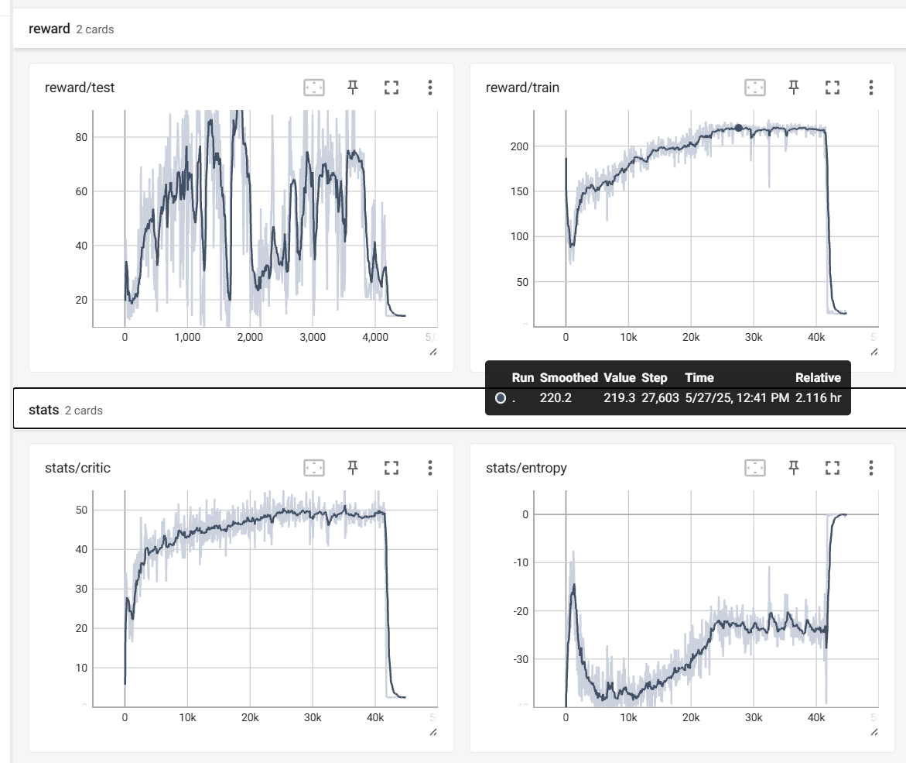
# 效果一般

# 改变state：使用效率！
# 还是不行啊，没学到！
CUDA_VISIBLE_DEVICES=3 python train_parse.py --eps_clip 0.2  --gamma 0.97 --lr_actor 0.0005 --lr_critic 0.0008 --pre_reward_ratio 5 --reward_scale_size 50000 --entropy_ratio 0.25  --K_epochs 5 --gae_flag --M 1
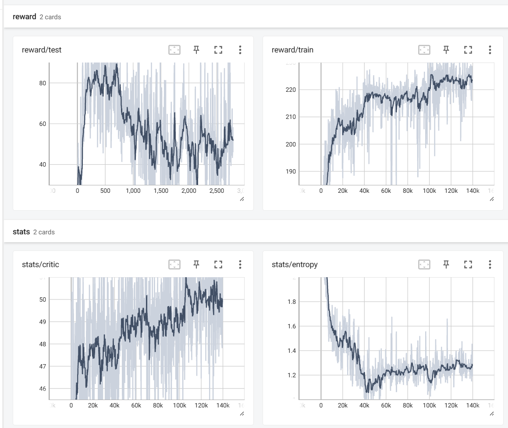

# 增加gamma gae-lambda
CUDA_VISIBLE_DEVICES=3 python train_parse.py --eps_clip 0.2  --gamma 0.99 --lr_actor 0.0005 --lr_critic 0.0008 --pre_reward_ratio 5 --reward_scale_size 50000 --entropy_ratio 0.25  --K_epochs 5 --gae_flag --M 1 --gae-lambda 0.99
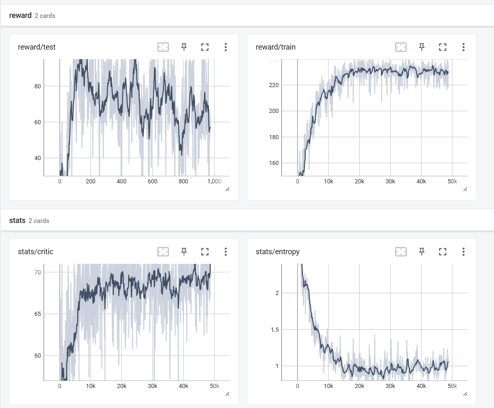

# 去掉gae模块
CUDA_VISIBLE_DEVICES=3 python train_parse.py --eps_clip 0.2  --gamma 0.99 --lr_actor 0.0005 --lr_critic 0.0008 --pre_reward_ratio 5 --reward_scale_size 50000 --entropy_ratio 0.25  --K_epochs 5  --M 1 --gae-lambda 0.99
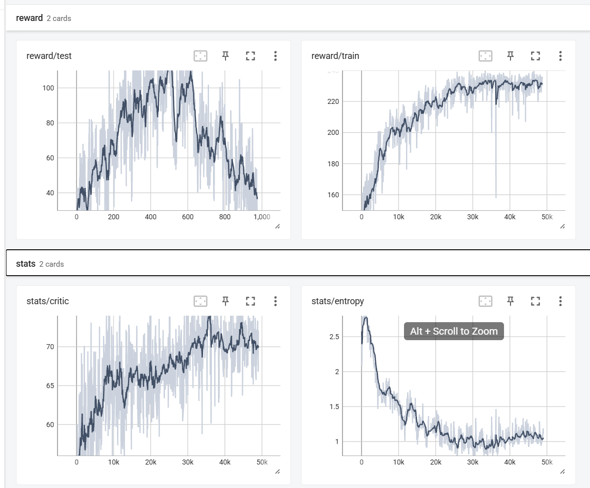

# 去掉强制，使用负奖励代替
# 还是没有学到啊
CUDA_VISIBLE_DEVICES=3 python train_parse.py --eps_clip 0.2  --gamma 0.99 --lr_actor 0.0005 --lr_critic 0.0008 --pre_reward_ratio 2 --reward_scale_size 50000 --entropy_ratio 0.25  --K_epochs 5  --M 1 --gae-lambda 0.99 --buffer_punishment
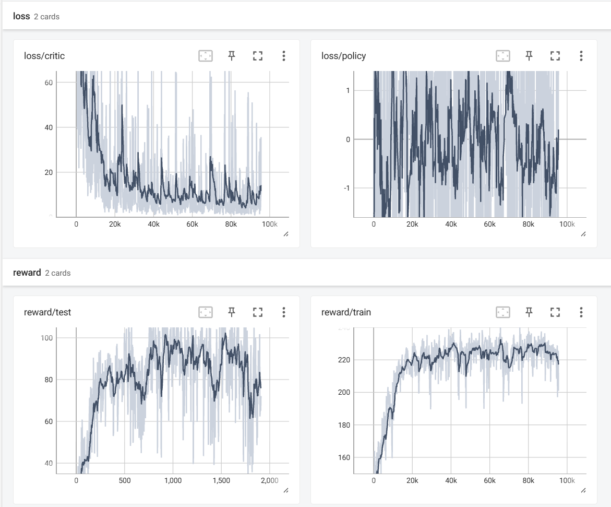

# 去掉强制，使用负奖励代替：注意要乘以系数
CUDA_VISIBLE_DEVICES=3 python train_parse.py --eps_clip 0.2  --gamma 0.99 --lr_actor 0.0005 --lr_critic 0.0008 --pre_reward_ratio 2 --reward_scale_size 50000 --entropy_ratio 0.25  --K_epochs 5  --M 1 --gae-lambda 0.99 --buffer_punishment
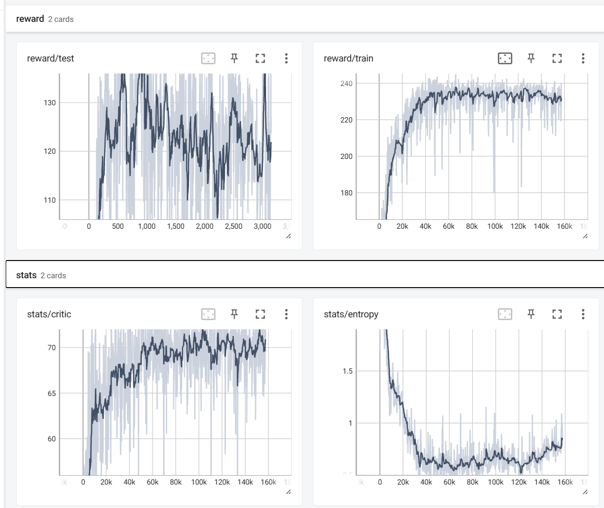

# 使用gae，提高 clip lr entropy
CUDA_VISIBLE_DEVICES=3 python train_parse.py --eps_clip 0.3  --gamma 0.99 --lr_actor 0.001 --lr_critic 0.001 --pre_reward_ratio 2 --reward_scale_size 50000 --entropy_ratio 0.3  --K_epochs 5  --M 1 --gae-lambda 0.99 --buffer_punishment --gae_flag

# 修改强制次数-7次
CUDA_VISIBLE_DEVICES=3 python train_parse.py --eps_clip 0.15  --gamma 0.99 --lr_actor 0.0005 --lr_critic 0.0008 --pre_reward_ratio 2 --reward_scale_size 50000 --entropy_ratio 0.25  --K_epochs 5  --M 1 --gae-lambda 0.99 --buffer_punishment --BS_back_times 7
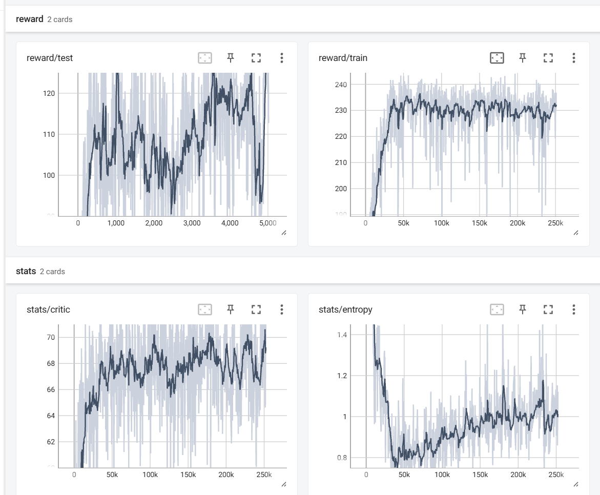

# 单机 修改强制次数-6次       任务数100左右
CUDA_VISIBLE_DEVICES=3 python train_parse.py --eps_clip 0.2  --gamma 0.99 --lr_actor 0.0005 --lr_critic 0.0008 --pre_reward_ratio 2 --reward_scale_size 50000 --entropy_ratio 0.25  --K_epochs 5  --M 1 --gae-lambda 0.99 --buffer_punishment --BS_back_times 6
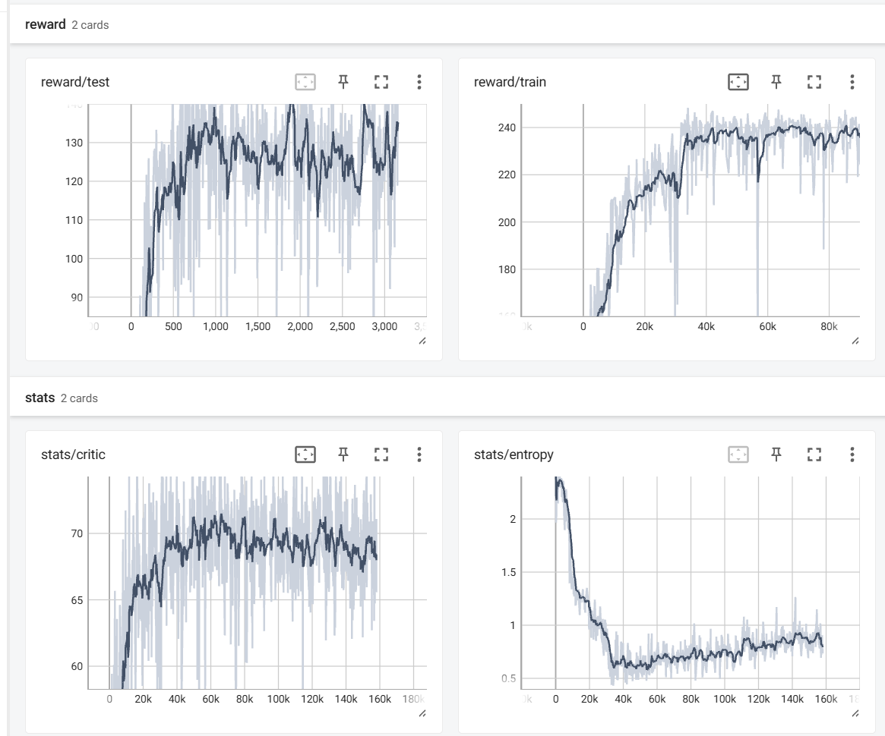
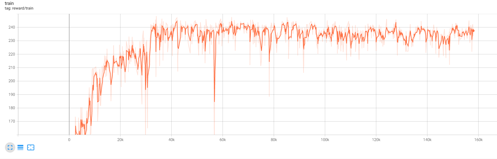

# !开始多无人机
CUDA_VISIBLE_DEVICES=3 python train_parse.py --eps_clip 0.2  --gamma 0.99 --lr_actor 0.0005 --lr_critic 0.0008 --pre_reward_ratio 2 --reward_scale_size 50000 --entropy_ratio 0.25  --K_epochs 5  --M 2 --gae-lambda 0.99 --buffer_punishment --BS_back_times 6
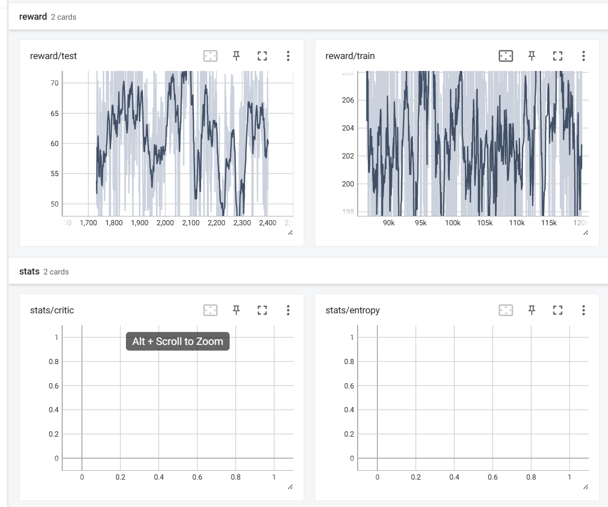
# 60左右的任务数，不大对劲

# ！不要别人的reward
#  125个任务一个无人机，265的reward
CUDA_VISIBLE_DEVICES=3 python train_parse.py --eps_clip 0.2  --gamma 0.99 --lr_actor 0.0005 --lr_critic 0.0008 --pre_reward_ratio 2 --reward_scale_size 50000 --entropy_ratio 0.08  --K_epochs 1 --M 2 --gae-lambda 0.99 --buffer_punishment --BS_back_times 6 --punishment_value 4
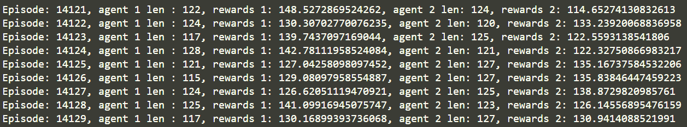
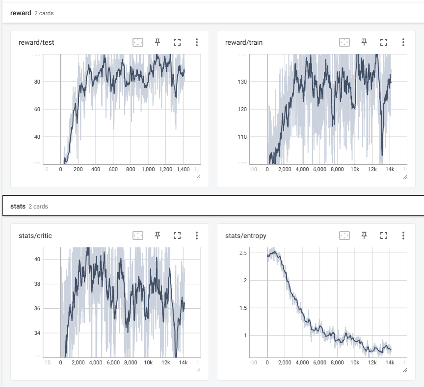
# 但是感觉奖励有问题，比如为什么多了这么多任务，收益那么低

# 换回合作的
# 感觉没收敛，训练久一点试试，
CUDA_VISIBLE_DEVICES=3 python train_parse.py --eps_clip 0.2  --gamma 0.99 --lr_actor 0.0005 --lr_critic 0.0008 --pre_reward_ratio 2 --reward_scale_size 50000 --entropy_ratio 0.08  --K_epochs 1 --M 2 --gae-lambda 0.99 --buffer_punishment --BS_back_times 6 --punishment_value 20
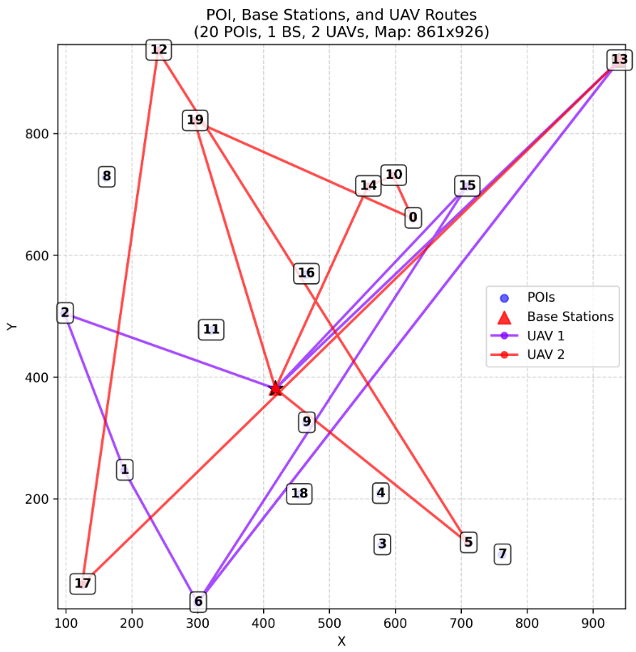
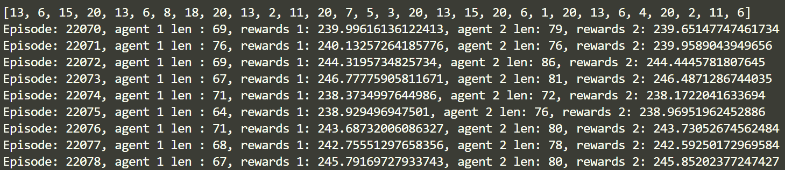
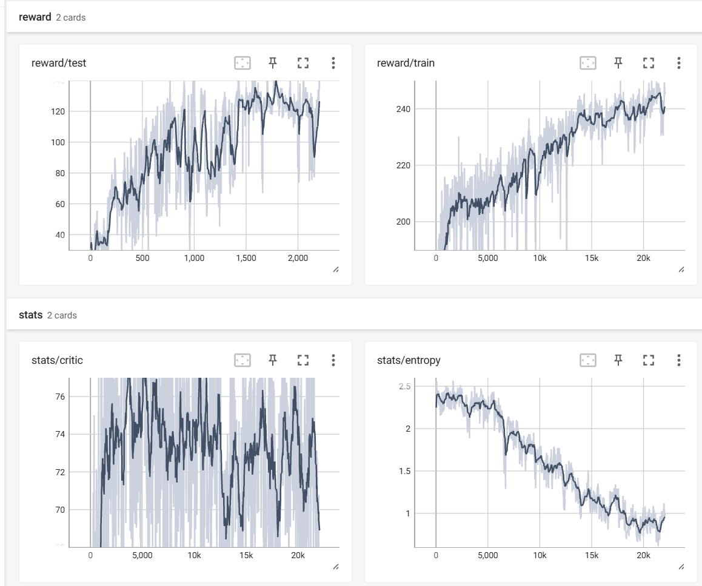

CUDA_VISIBLE_DEVICES=3 python train_parse.py --eps_clip 0.2  --gamma 0.99 --lr_actor 0.0005 --lr_critic 0.0008 --pre_reward_ratio 2 --reward_scale_size 50000 --entropy_ratio 0.08  --K_epochs 1 --M 2 --gae-lambda 0.99 --buffer_punishment --BS_back_times 6 --punishment_value 20 --max_training_timesteps 8000000
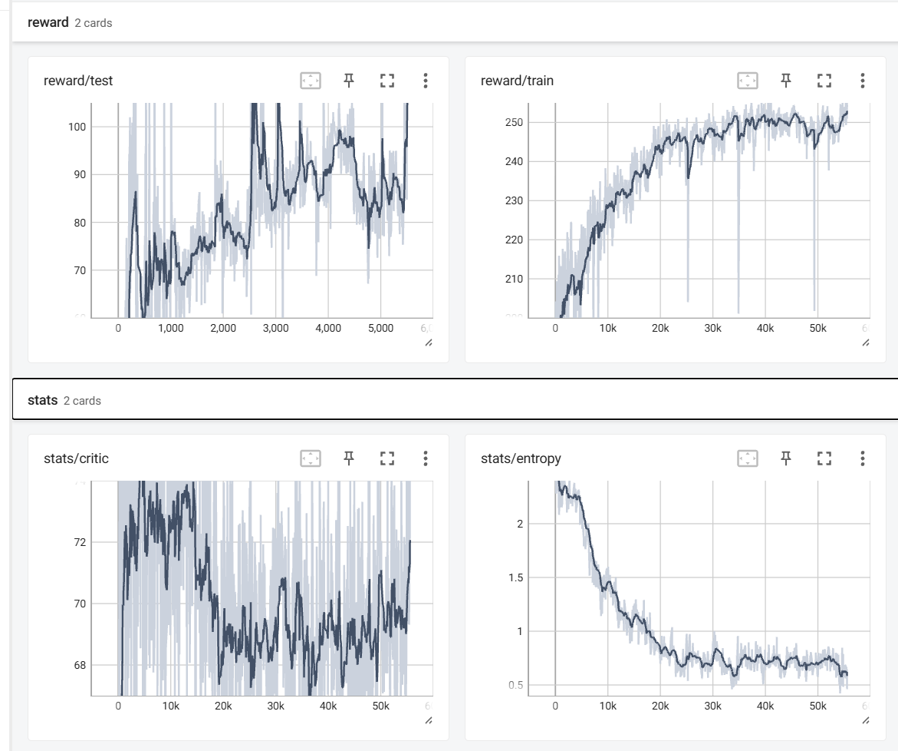
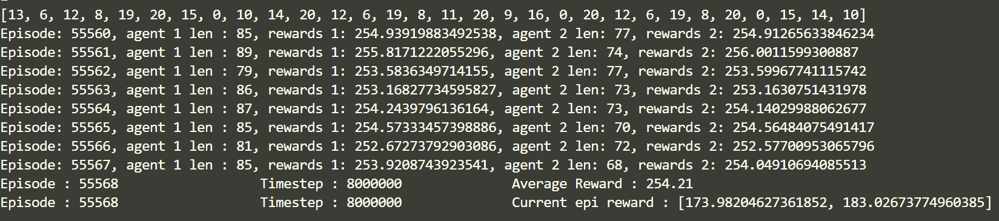

# 3个无人机，竞争
# 其中有一个无人机效果一般般，283左右
CUDA_VISIBLE_DEVICES=3 python train_parse.py --eps_clip 0.2  --gamma 0.99 --lr_actor 0.0005 --lr_critic 0.0008 --pre_reward_ratio 2 --reward_scale_size 50000 --entropy_ratio 0.08  --K_epochs 1 --M 3 --gae-lambda 0.99 --buffer_punishment --BS_back_times 6 --punishment_value 4 --max_training_timesteps 5000000
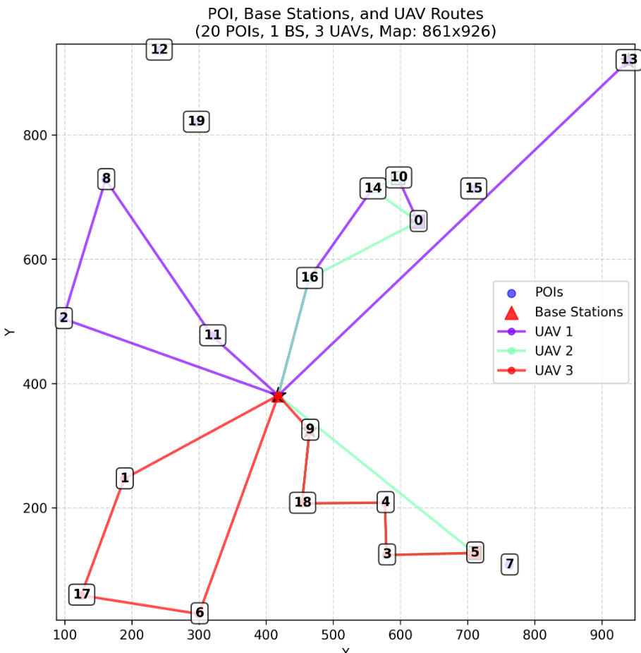
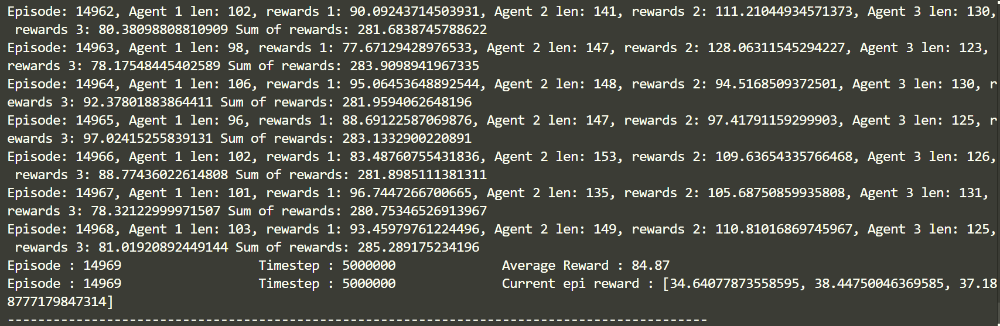

# 提高entropy-0.2
# 效果差了一些，entropy太大了
CUDA_VISIBLE_DEVICES=3 python train_parse.py --eps_clip 0.2  --gamma 0.99 --lr_actor 0.0005 --lr_critic 0.0008 --pre_reward_ratio 2 --reward_scale_size 50000 --entropy_ratio 0.2  --K_epochs 1 --M 3 --gae-lambda 0.99 --buffer_punishment --BS_back_times 6 --punishment_value 4 --max_training_timesteps 5000000
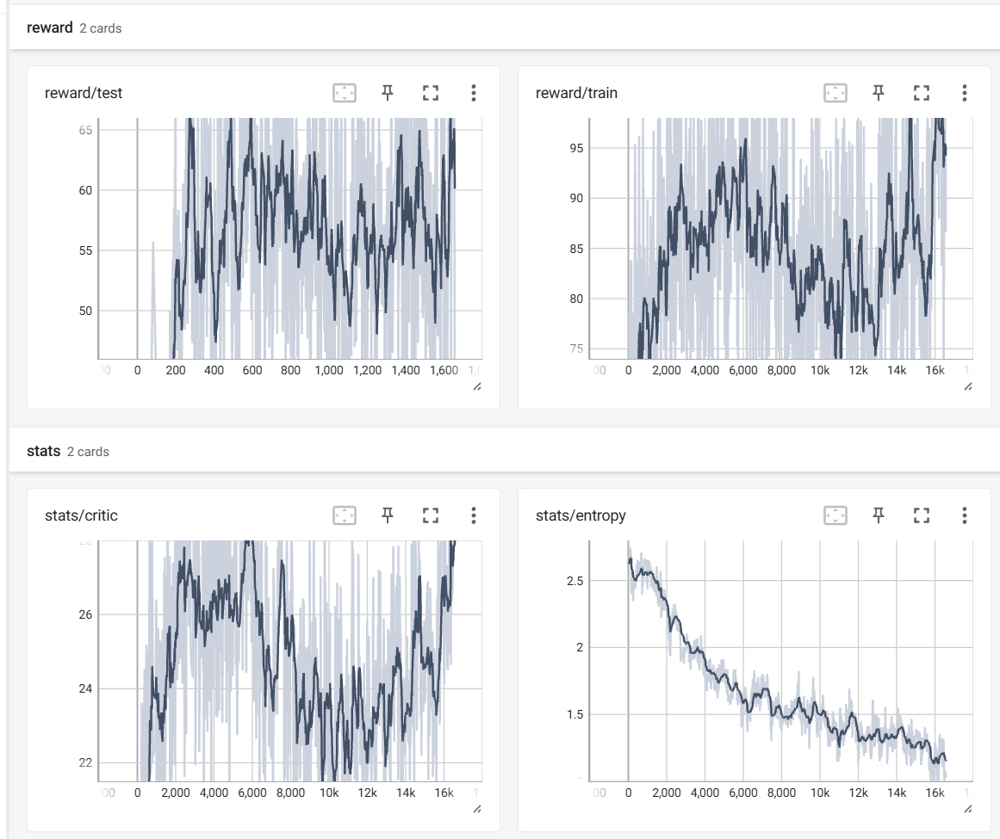
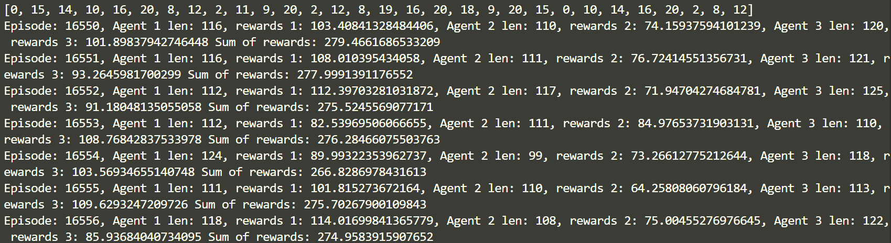

# 3机 提高entropy-0.13
# reward 280左右 波动稍微有点大
CUDA_VISIBLE_DEVICES=3 python train_parse.py --eps_clip 0.2  --gamma 0.99 --lr_actor 0.0005 --lr_critic 0.0008 --pre_reward_ratio 2 --reward_scale_size 50000 --entropy_ratio 0.13  --K_epochs 1 --M 3 --gae-lambda 0.99 --buffer_punishment --BS_back_times 6 --punishment_value 4 --max_training_timesteps 5000000
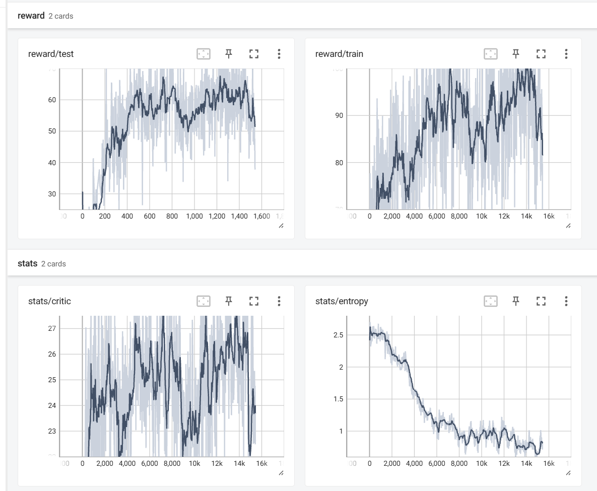
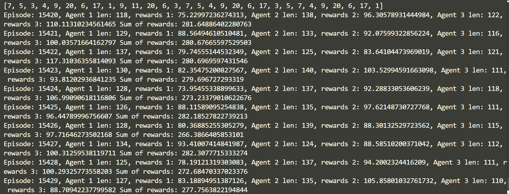

# 单机 修改强制次数-6次
CUDA_VISIBLE_DEVICES=3 python train_parse.py --eps_clip 0.2  --gamma 0.99 --lr_actor 0.0005 --lr_critic 0.0005 --pre_reward_ratio 2 --reward_scale_size 50000 --entropy_ratio 0.3  --K_epochs 5 --M 1 --gae-lambda 0.992 --buffer_punishment --BS_back_times 7 --punishment_value 3

# 合作：done之后统一发放奖励（不是回基站后把别人的奖励给他）

# 测试环境的正确性，打印同一轮中，他们收集同一个设备的可能性

